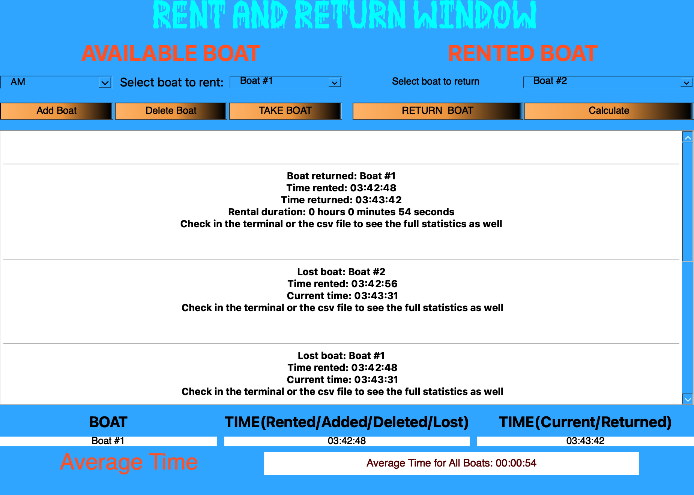

# Boat Management System With PyQt5

The Boat Management System is a Python application developed using PyQt5 for managing boat rentals and keeping track of rental duration.



## Features
- **Add New Boat:** Add a new boat to the system.
- **Delete Boat:** Remove a boat from the system.
- **Rent Boat:** Rent a boat, marking it as rented.
- **Return Boat:** Return a rented boat, recording the rental duration.
- **Average Time Calculation:** Calculate the average rental time for all boats.
- **Lost Boat Detection:** Automatically detect boats that are not returned and mark them as lost.

## Getting Started

### Prerequisites
Before running the Boat Management System, ensure you have the following prerequisites installed:

- **Python:** Make sure you have Python 3.x installed. You can download it from [Python's official website](https://www.python.org/downloads/).
- **Required Python Libraries:** Install the necessary Python libraries using `pip`:

    ```bash
    pip install PyQt5
    ```

### Installation

1. Clone the Boat Management System repository to your local machine:

    ```bash
    git clone https://github.com/Hetawk/boat-management-system.git
    ```

2. Navigate to the project directory:

    ```bash
    cd boat-management-system
    ```

### Usage

1. Run the `main.py` file to start the application:

    ```bash
    python main.py
    ```

2. The application will open a graphical user interface (GUI) for boat management.
3. Use the provided interface to interact with the system. You can:
   - **Add New Boat:** Add a new boat to the system.
   - **Delete Boat:** Remove a boat from the system.
   - **Rent Boat:** Rent a boat, marking it as rented.
   - **Return Boat:** Return a rented boat, recording the rental duration.
   - **Calculate Average Time or Longest Time:** Press the "Calculate" button to calculate the average rental time for all boats.

4. Check the application's text area for logs, statistics, and boat rental information. Statistics are also shown in a csv file.
5. The system also automatically checks for lost boats and logs them. These are boats that were rented but not returned.

## Capturing Screenshots (Optional)

### Introduction

While using the Boat Management System (BMS) GUI app, users have the option to capture screenshots of the application's interface. This can be useful for documenting interactions or recording the app's behavior during specific tasks.

### How It Works
#### The Script: `capturescreen.py`

The `capturescreen.py` script is designed to capture screenshots at regular intervals. Here's how it works:

- The script imports the `UI` class from the `main.py` file, which is assumed to be the main script for the Boat Management System GUI app.
- A directory named "screenshots" is created to store the captured screenshots.
- The `capture_screenshot` function captures and saves a screenshot. The screenshot names are generated with incremental numbers (e.g., `screenshot_0.png`, `screenshot_1.png`) and saved in the "screenshots" directory.
- An initial screenshot of the app's main window is captured when the script is first run and is named "initial_screenshot.png."
- A timer is set to capture screenshots every 5 seconds while the app is running.

#### How to Use It

Users have the flexibility to choose whether they want to use the screenshot capturing functionality. They can decide whether or not to run the `capturescreen.py` script alongside the main app (`main.py`).

- If screenshots are desired, users can run the `capturescreen.py` script. This script captures screenshots at regular intervals, providing a record of the app's behavior during their interactions.
- If screenshots are not needed, users can simply run the main app (`main.py`) without the `capturescreen.py` script. This allows them to use the app without generating screenshots.

The choice of running `capturescreen.py` depends on the user's preference and whether they want to document their interactions with the Boat Management System GUI app.

## Author

- [Enoch Kwateh Dongbo](https://github.com/hetawk)


## Acknowledgments

- Thanks to PyQt for providing the user interface framework.
- This project was inspired by the need for efficient boat rental management.
